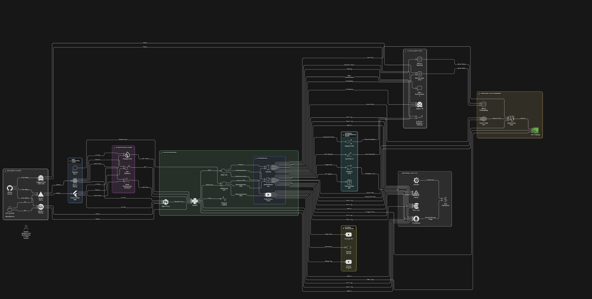

# System Architecture

## Overview
Diploma Dude follows a modular architecture integrating backend APIs, AI processing, and user management components.

## Core Components
1. **Frontend:** Built using HTML, CSS, and JavaScript for responsive user interaction.  
2. **Backend:** Implemented using Python (Flask/FastAPI) to handle routing, AI integration, and data requests.  
3. **AI Engine:** Powered by the Zephyr 7B Alpha model for natural language explanations.  
4. **Database:** Firebase for authentication and PostgreSQL for data storage.  
5. **External APIs:** YouTube for video recommendations, and SBTET for student records access.

## Data Flow
1. User query is sent from the frontend to backend.  
2. Backend communicates with AI model via API.  
3. AI returns structured explanation and media suggestions.  
4. Results are displayed and stored for personalization.

## Architecture Diagram

